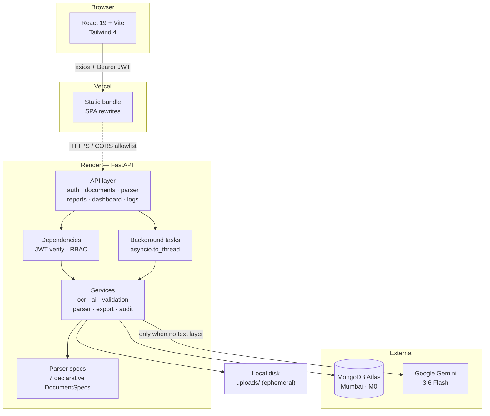
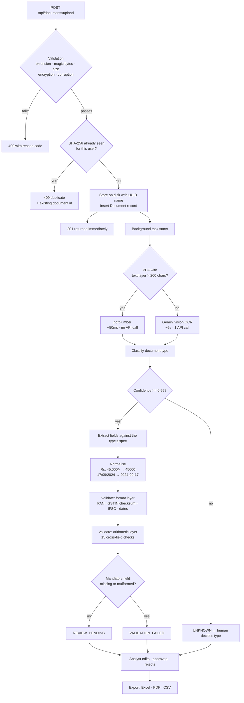
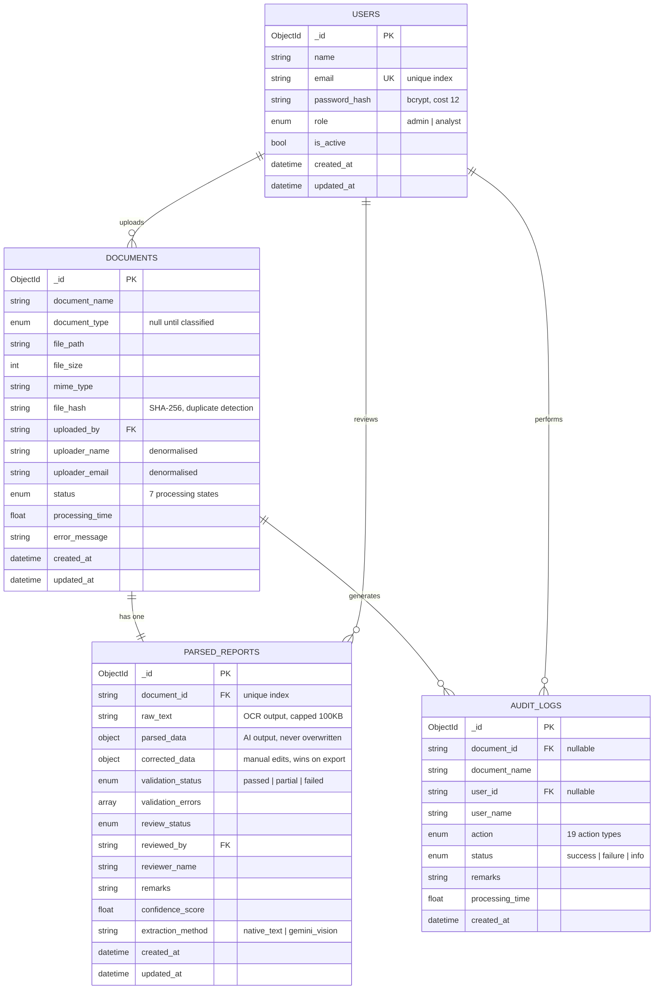

# Architecture

## System overview

## Processing pipeline

The decision that shapes the whole system is at the OCR step: most Indian
financial PDFs are digitally generated and already carry a text layer. Reading
that directly is faster, free, and more accurate than sending pixels to a
vision model. The model is the fallback, not the default.

Every stage writes an audit entry, so `GET /api/logs/document/{id}` returns the
document's full timeline with per-stage timings.

## Database schema

Four collections. MongoDB has no foreign keys, so the relationships below are
enforced in application code — a deliberate trade documented under Known
Limitations in the README.

### Indexes and why each exists

| Collection | Index | Reason |
|---|---|---|
| `users` | `email` (unique) | Prevents duplicate accounts under concurrent registration — an application-level check has a race window |
| `documents` | `uploaded_by + file_hash` | Duplicate detection is always scoped per user, so one compound index serves the lookup |
| `documents` | `status + created_at` | The document list filters by status and sorts newest-first — the hot path |
| `documents` | `document_name` (text) | Filename search |
| `parsed_reports` | `document_id` (unique) | Enforces one report per document |
| `parsed_reports` | `parsed_data.$**` (wildcard) | Indexes every extracted field at any depth, so PAN, GSTIN, invoice number, account number and names are all searchable without an index per field |
| `audit_logs` | `document_id`, `created_at` | Timeline reconstruction per document |

### Schema decisions worth explaining

**`parsed_data` as a JSON object, not columns.** The seven document types share
almost no fields — a bank statement has an IFSC code, a salary slip has a PF
deduction. A relational table would be roughly 60 columns that are 85% NULL.

**`corrected_data` stored separately from `parsed_data`.** When a reviewer fixes
a value, the model's original output survives. Overwriting it would make
"how accurate is our extraction?" permanently unanswerable.

**Reports split from documents rather than embedded.** The pure-Mongo instinct
is to embed, but a bank statement's transaction list plus raw OCR text can
exceed 100 KB. The document list endpoint is the most-hit route and needs none
of it, so embedding would drag that payload into every page of results.

**Uploader name and email denormalised onto documents.** This is the extended
reference pattern: the list view shows who uploaded each file without a lookup
per row. The trade is that renaming a user leaves historical documents showing
the old name — arguably correct for an audit trail.
